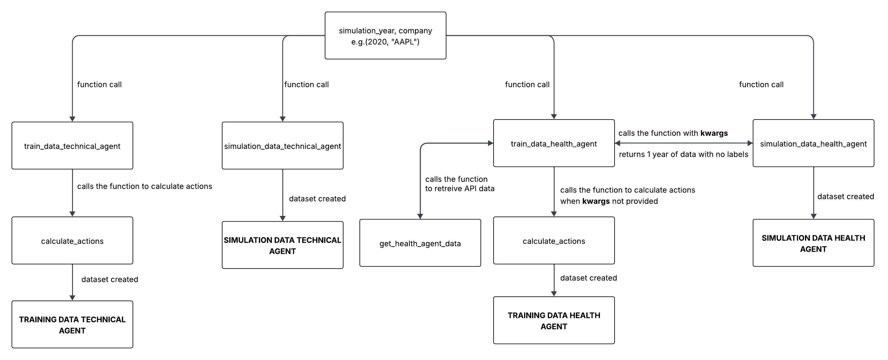

# Data Preparation Documentation
This documentation explains how data is prepared for the first initial model of the MAS system.

## Datasets Used
Datasets used:
1. `yfinance`
2. `Alpha Vantage API Data`

`yfinance` is a python library, just like Pandas, etc. that can obtain historical data for specific stock. `yfinance` is used primarily for calculating optimal decision for training datasets for both **technical** and **health** agent, and is the only source of data for **technical** agent. 

`Alpha Vantage API Data` is used for health agent. The API collects 3 financial components for a specific company - **balance sheet**, **income statement**, and **EPS**. The reason this data source is used is that `yfinance` can't go back in history as far as `Alpha Vantage API Data` to obtain **balance sheet**, **income statement**, and **EPS** for each quarter. 

## Actions
Actions refer to a target variable (~ optimal action) representing **buy**, **hold**, or **sell**. Neither of the datasets have such variable, since both datasets have financial data without labels. Since the overall aim of the system is to have the best portfolio's value at the end of simulation compared to the **baseline approach** (buy at the start of the year and hold until the end) and **one agent** (most likely technical agent), the primary interest is in the stock's price. 

The actions are calculated by the `calculate_actions` function. The function's inputs are a `company` and `simulation_year` variables. `company` argument is the company of interest symbol (the ticker, e.g. AAPL for Apple) and the `simulation_year` is the intended simulation year. 

The function retreives data for 2 training years **(simulation_year - 2 and simulation_year - 1)** for a specific company. The function then calculates optimal action by looking at a price of the stock **5 days ahead**. If the price **goes up by at least 1%**, the optimal action is **buy**. If the price **goes down by at least 1%**, the optimal action is **sell**. Else, the action is **hold**. To handle the last 5 days, the optimal action is not calculated by **looking 5 days ahead**, but rather looking at the **very last day's price of the training data** following the same rules for action. The last day **copies the optimal decision from the day before**.

This function is used in all functions creating training data for an agent. 

Actions' Labels:
1. `buy`: labelled as `1`
2. `sell`: labelled as `-1`
3. `hold`: labelled as `0`

## Technical Agent
The technical agent's data are only retreived from `yfinance` data. The data used are **stock prices** for each day as well as **volatility index** for each day.

### train_data_technical_agent Function
This function prepares training dataset for technical agent. The function calculates following features:
1. `Moving Averages (10-day)`: average price over 10 days
2. `Daily Price Change`: difference between stock's opening price for the day and the ending price at the end of the day
3. `Daily Price Fluctuation`: difference between the largest value of a stock for a day and the lowest value of the stock for the day 
4. `Volatility`: how greatly a stock or other asset’s prices swing around the mean price - represents "market's fear"
5. `Volatility Change`: difference between highest and lowest volatility
6. `Volume Change`: change in volume between current and previous day (number of shares traded)
7. `Action (decision)`: optimal action (target variable - 0 hold, 1 buy, -1 sell)

**Moving Averages (10-day):**
This feature represents average price over 10 days. However, since this creates nulls and adds a value to each 10th day, backward fill is used to fill out days 0-9.

**Daily Price Change:**
`yfinance` data has opening and closing prices for each day. This feature represents difference between the opening (starting) price for the stock each day and the closing (ending) price for a stock each day.

**Daily Price Fluctuation:**
`yfinance` also has lowest and highest price for a stock for each day. This feature represents a difference between the largest price for a stock on a day and the lowest price for a stock on a particular day.

**Volatility:**
This feature is taken from the the **volatility index** from `yfinance`. This feature represents market's fear - it represents investor sentiment regarding market risk and uncertainty, with higher values indicating greater fear and volatility. The value is taken from as the closing (ending) value from **volatility index** from `yfinance`.

**Volatility Change:**
Just like **daily price change**, this feature represents a difference between the largest and the smallest **volatility index** value for each day.

**Volume Change:**
Volume represents number of shares of a particular stock traded on particular day. The feature represents a difference between current and previous day. As such, the very first day starts with 0.

**Actions:**
Lastly, the dataset needs to be labeled for the model to learn. As such, `calculate_actions()` is called which returns recommended actions (target variable) as list from which a new column is created and added to the training dataset.

### simulation_data_technical_agent Function
This function calculates all the features just like the `train_data_technical_agent()`, but it removes the target variable `actions` from the dataset.

## Health Agent
The health agent's priority/aim/objective is to be able to learn/determine when the firm is "financially healthy" and when not. The agent uses financial ratios and information from quaterly **balance sheets** and **income statements**. However, the only drawback for this agent is that it currently uses features that stay the same for each quarter, except one feature. This may be an area for an improvement in refined version of the system.

Since `yfinance` has such quaterly **balance sheets** and **income statements**, it only returns such reports for the last few quarters. As such, `Alpha Vantage API Data` data is retreived and used.

### get_health_agent_data Function
This function retreives all quaterly **balance sheets**, **income statements**, and **EPS** datasets. There are **3 API** calls, one for each quaterly report, with a delay of 20 seconds between each call to ensure the API does not get overwhelmed and actually returns data. The function also retreives **4 years** of stock's price data with the **simulation year** being the most recent year. 

All objects returned by the `Alpha Vantage API Data` are converted to dataframes, their index (date) is converted to **datetime** data type and standardized to uniform time index, just like in the function for the **technical agent**. The data retrived by `Alpha Vantage API Data` is covering years that are not fully covered by the `yfinance` data retreival, the data returned by the function is of length of data returned by `yfinance`, since that is in the range of interest and little beyond for certain features to be calculated for first day for both training and simulation datasets. `Alpha Vantage API Data` returns all data as strings, as such, they are converted to numerical data type and joined with the data retreived by `yfinance`. The main thing is that dates in which the quaterly reports could have been reported are on different dates when the stock is being traded. As such, special merge is performed, which joins the both the `yfinance` data and `Alpha Vantage API Data` data on their index (date), however, in case there are no **exact matches**, the data is joined on the closest date from `yfinance` data before (e.g. if quaterly reports are released on Sunday, but stock is traded on Friday and Monday, then the quaterly reports data is added to the Friday's entry). The data is then filled out using forward fill to cover all days, since quaterly reports have 4 entries per year and stock is traded approximately 251 days a year. 

### train_data_health_agent Function
This function creates training dataset for health agent. The function calculates following features:
1. `Revenue Growth`: an increase/decrease in revenue over time
2. `Net Income`: profit a company retains after all expenses, taxes, and deductions
3. `Profit Margin`: a percentage of profit earned by a company in relation to its revenue
4. `Debt-to-equity Ratio`: a ratio comparing company's liabilities and its shareholder equity
5. `Current Ratio`: a liquidity ratio measuring whether the company has enough resources/can meet its short-term obligations
6.  `Earnings per Share`: indication of company's curren financial strength
7. `Price-to-earnings Ratio`: a ratio telling how much investors are paying for a dollar of a company's earnings
8. `Action`: an optimal action determined by the function for actions

To handle the flow and not have any additional input other than the **simulation year** and the **company of interest**, **kwargs** argument is added. This argument is checked at the very top of the function - it is only used in when `train_data_health_agent` function is called for creating simulation data to know long the dataset should be - for training, it returns 2 years of data, for simulation it returns 1 year of data.

**Revenue Growth:**
This feature is calculated as a percentage change in revenue between quarterly data using `.pct_change()` method. However, since the formula looks at current revenue and previous revenue, for first day of the simulation and training, there is a need to obtain Q4 and Q3 reports from the year before the training year - that is why `get_health_agent_data` function returns 4 years of data.

$$\text{Revenue Growth \%} = \left( \frac{\text{Current Period Revenue} - \text{Prior Period Revenue}}{\text{Prior Period Revenue}} \right)$$

**Net Income:**
This feature represents quaterly net income of the company. 

**Profit Margin:**
This feature represents profit margin.

$$\text{Net Profit Margin} = \left( \frac{\text{Net Profit}}{\text{Total Revenue}} \right)$$

**Debt-to-equity Ratio:**
This feature represents debt-to-equity ratio. 

$$\text{Debt-to-Equity Ratio} = \frac{\text{Total Liabilities}}{\text{Total Shareholders' Equity}}$$

**Current Ratio:**
This feature represents current ratio.

$$\text{Current Ratio} = \frac{\text{Current Assets}}{\text{Current Liabilities}}$$

**Earnings per Share:**
This feature represents quaterly EPS and is retreived by the `Alpha Vantage API Data` directly.

**Price-to-earnings Ratio:**
This feature represents rrice-to-earnings ratio and is the only feature that changes daily.

$$\text{Price-to-earnings Ratio} = \frac{\text{Market Value per Share}}{\text{Earnings per Share}}$$

**Action:**
If **kwargs** are provided (only provided when simulation dataset is created), then the function returns dataframe for 1 year with all 7 features, excluding actions. If **kwargs** are not provided, `calculate_actions()` is called which returns recommended actions (target variable) as list from which a new column is created and added to the training dataset.

### simulation_data_health_agent Function
This function creates simulation dataset for health agent. The dataset is created by calling `train_data_health_agent()` function and **kwargs** argument is provided, telling the function to avoid adding **actions** and returning only 1 year of data for the simulation year. 

## Workflow

